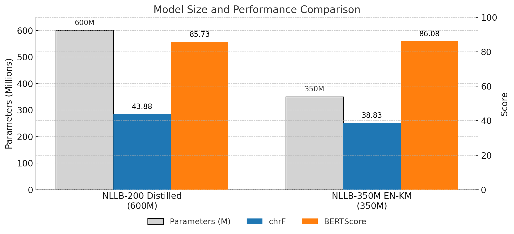

# NLLB-200-Distilled-350M-EN-KM

A compact English-to-Khmer neural machine translation model based on knowledge distillation from NLLB-200, achieving competitive translation quality with 42% fewer parameters and enhanced computational efficiency.

## Quick Navigation

- [Overview](#overview)
- [Getting Started](#getting-started)
- [Model List](#model-list)
- [Use NLLB-EN-KM with Huggingface](#use-nllb-en-km-with-huggingface)
- [Train NLLB-EN-KM](#train-nllb-en-km)
- [Requirements](#requirements)
- [Evaluation](#evaluation)
- [Training](#training)
- [Bugs or Questions?](#bugs-or-questions)
- [Acknowledgments](#acknowledgments)
- [Citation](#citation)

## Overview

I propose a knowledge distillation framework that addresses the computational efficiency challenges of large-scale neural machine translation models while preserving translation quality. My approach reduces the parameter count of the NLLB-200 model from 600M to 350M parameters through `layer pruning` and `knowledge distillation`, specifically optimized for English-to-Khmer translation. 

The following figure demonstrates a 42% parameter reduction while maintaining competitive translation performance, with the distilled model achieving a chrF score of 38.83 compared to the 600M baseline's 43.88.



### Key Features

- **Compact Architecture**: 350M parameters (3 encoder layers, 3 decoder layers)
- **Knowledge Distillation**: Trained using teacher-student approach with NLLB-200-1.3B as teacher
- **High-Quality Translation**: Optimized specifically for English-Khmer language pair
- **Production Ready**: Includes evaluation benchmarks and training scripts

### Model Performance Comparison

| Model | Parameters | chrF Score | BERTScore F1 | Training Epochs |
|-------|------------|------------|--------------|-----------------|
| **NLLB-350M-EN-KM (Ours)** | 350M | 38.83 | 0.8608 | 10 |
| NLLB-200-Distilled-600M | 600M | 43.88 | 0.8573 | - |

*Evaluation performed on Asian Language Treebank (ALT) dataset with English-Khmer pairs*

## Getting Started

### Quick Installation

```bash
pip install transformers torch datasets
```

### Basic Usage

```python
from transformers import AutoTokenizer, AutoModelForSeq2SeqLM

# Load model and tokenizer
model = AutoModelForSeq2SeqLM.from_pretrained("lyfeyvutha/nllb_350M_en_km_v10")
tokenizer = AutoTokenizer.from_pretrained("facebook/nllb-200-distilled-600M")

# Configure for English to Khmer translation
tokenizer.src_lang = "eng_Latn"
tokenizer.tgt_lang = "khm_Khmr"

# Translate
text = "Hello, how are you?"
inputs = tokenizer(text, return_tensors="pt")
outputs = model.generate(**inputs, forced_bos_token_id=tokenizer.convert_tokens_to_ids("khm_Khmr"))
translation = tokenizer.decode(outputs[0], skip_special_tokens=True)
print(translation)
```

## Model List

| Model Name | Purpose | Training Epochs | Status | HuggingFace Link |
|------------|---------|-----------------|--------|------------------|
| `nllb_350M_en_km_v1` | Proof of Concept | 1 epoch | Available | [lyfeyvutha/nllb_350M_en_km_v1](https://huggingface.co/lyfeyvutha/nllb_350M_en_km_v1) |
| `nllb_350M_en_km_v10` | Research Evaluation | 10 epochs | Available | [lyfeyvutha/nllb_350M_en_km_v10](https://huggingface.co/lyfeyvutha/nllb_350M_en_km_v10) |

## Use NLLB-EN-KM with Huggingface

### Loading the Model

```python
import torch
from transformers import AutoTokenizer, AutoModelForSeq2SeqLM, GenerationConfig

# Configuration
CONFIG = {
    "model_name": "lyfeyvutha/nllb_350M_en_km_v10",
    "tokenizer_name": "facebook/nllb-200-distilled-600M",
    "source_lang": "eng_Latn",
    "target_lang": "khm_Khmr",
    "max_length": 128
}

# Load model and tokenizer
model = AutoModelForSeq2SeqLM.from_pretrained(CONFIG["model_name"])
tokenizer = AutoTokenizer.from_pretrained(
    CONFIG["tokenizer_name"],
    src_lang=CONFIG["source_lang"],
    tgt_lang=CONFIG["target_lang"]
)

# Set up generation configuration
khm_token_id = tokenizer.convert_tokens_to_ids(CONFIG["target_lang"])
generation_config = GenerationConfig(
    max_length=CONFIG["max_length"],
    forced_bos_token_id=khm_token_id
)
```

### Batch Translation

```python
def translate_batch(sentences, model, tokenizer, generation_config, device, batch_size=32):
    """Translate sentences in batches for better performance."""
    all_translations = []
    for i in range(0, len(sentences), batch_size):
        batch = sentences[i:i+batch_size]
        inputs = tokenizer(batch, return_tensors="pt", padding=True, truncation=True)
        inputs = {k: v.to(device) for k, v in inputs.items()}
        
        with torch.no_grad():
            output_ids = model.generate(**inputs, generation_config=generation_config)
        
        translations = [tokenizer.decode(output_id[1:], skip_special_tokens=True) 
                       for output_id in output_ids]
        all_translations.extend(translations)
    
    return all_translations
```

## Train NLLB-EN-KM

### Data Preparation

I provide a CSV to JSON converter for preparing your training data:

```python
from converter import convert_csv_to_nllb_format

# Convert CSV to NLLB training format
result = convert_csv_to_nllb_format(
    csv_file_path="your_data.csv",
    output_file_path="training_data.json",
    eng_column="english",  # or let it auto-detect
    khm_column="khmer"     # or let it auto-detect
)
```

### Expected Data Format

```json
{
  "train": [{
    "data": [
      {
        "eng_Latn": "Hello, how are you?",
        "khm_Khmr": "សួស្ដី តើអ្នកសុខសប្បាយទេ?"
      }
    ]
  }]
}
```

### Training Configuration

```python
class Config:
    # Model parameters
    SOURCE_MODEL = "facebook/nllb-200-1.3B"      # Teacher model
    TARGET_MODEL = "facebook/nllb-200-distilled-600M"  # Student model
    SOURCE_LANG = "eng_Latn"
    TARGET_LANG = "khm_Khmr"
    
    # Distillation parameters
    TARGET_ENCODER_LAYERS = 3
    TARGET_DECODER_LAYERS = 3
    TEMPERATURE = 5
    LAMBDA_PARAM = 0.5
    
    # Training hyperparameters
    BATCH_SIZE = 48
    NUM_EPOCHS = 10
    LEARNING_RATE = 3e-5
    MAX_SEQ_LENGTH = 128
```

## Requirements

### System Requirements

| Component | Requirement |
|-----------|-------------|
| **GPU** | NVIDIA A100-SXM4-80GB (recommended) |
| **CUDA** | 12.8+ |
| **Memory** | 80GB GPU memory for training |
| **Python** | 3.8+ |

### Python Dependencies

```bash
pip install torch>=2.4.1
pip install transformers>=4.38.2
pip install datasets>=2.19.1
pip install accelerate>=0.28.0
pip install evaluate
pip install bert-score
pip install wandb  # for experiment tracking
pip install python-dotenv
```

## Evaluation

### Evaluation Dataset

My model evaluation is conducted on the **Asian Language Treebank (ALT)** corpus, which provides high-quality manual translations between English and Khmer. The ALT corpus contains approximately 20,000 sentences originally sampled from English Wikinews and manually translated by native speakers into 13 Asian languages including Khmer.

**ALT Dataset Access**: The evaluation dataset is available through Hugging Face: `mutiyama/alt`

**Dataset Details**:
- **20,106 total sentences** across all splits (train/dev/test)
- **High translation quality** verified by native speakers  
- **Consistent evaluation standard** for English-Khmer translation systems
- **Open license**: Creative Commons Attribution 4.0 International (CC BY 4.0)

### Performance Metrics

I evaluate my models using standard machine translation metrics:

- **chrF Score**: Character n-gram F-score for better handling of morphologically rich languages
- **BERTScore**: Semantic similarity using multilingual BERT embeddings

### Evaluation Results

```python
# Evaluation results on ALT dataset
results = {
    "nllb_350M_en_km_v10": {
        "chrF": 38.8338,
        "BERTScore_F1": 0.8608
    },
    "nllb_600M_baseline": {
        "chrF": 43.8828,
        "BERTScore_F1": 0.8573
    }
}
```

### Running Evaluation

```bash
# Run evaluation notebook
jupyter notebook eval.ipynb
```

## Training

### Knowledge Distillation Process

My training process uses knowledge distillation with the following architecture:

```
Teacher Model (NLLB-1.3B)
         ↓
   Knowledge Transfer
         ↓
Student Model (600M → 350M)
```

### Training Pipeline

1. **Model Initialization**: Load teacher (1.3B) and student (600M) models
2. **Architecture Reduction**: Reduce student to 3 encoder + 3 decoder layers
3. **Knowledge Distillation**: Train with temperature=5 and λ=0.5
4. **Optimization**: Use AdamW with cosine learning rate scheduling

### Training Metrics

| Epoch | Training Loss | Validation Loss |
|-------|---------------|-----------------|
| 1 | 0.658600 | 0.674992 |
| 2 | 0.534500 | 0.596366 |
| 3 | 0.484700 | 0.566999 |
| 4 | 0.453800 | 0.549162 |
| 5 | 0.436300 | 0.542330 |
| 6 | 0.432900 | 0.536817 |
| 7 | 0.421000 | 0.534668 |
| 8 | 0.412800 | 0.532001 |
| 9 | 0.417400 | 0.533419 |
|10	| 0.413200 | 0.531947 |

*Training performed on 316,110 English-Khmer sentence pairs*

### Starting Training

```bash
# Set up environment variables
export HF_TOKEN="your_huggingface_token"
export WANDB_API_KEY="your_wandb_key"
export TRAINING_DATA_PATH="path/to/your/data.json"

# Run training
jupyter notebook training.ipynb
```

## Bugs or Questions?

If you encounter any issues or have questions:

1. **Check the Issues**: Browse existing [GitHub Issues](https://github.com/lyfeyvutha/nllb-200-distilled-350M-en-km/issues)
2. **Create New Issue**: Use my issue templates for bug reports or feature requests
3. **Contact**: Lyfey (`lyfeytech@gmail.com`)

### Common Issues

- **Memory Issues**: Reduce batch size or use gradient accumulation
- **CUDA Errors**: Ensure CUDA 12.8+ compatibility
- **Data Format**: Verify JSON structure matches expected format

## Acknowledgments

This work builds upon Meta's NLLB-200 models and uses the Asian Language Treebank (ALT) corpus for evaluation. Special thanks to [newfull5](https://github.com/newfull5) for the methodological inspiration and ALT project contributors for providing high-quality English-Khmer parallel data.

## Citation

### This Work
If you use this work in your research, please cite:

```bibtex
@misc{nllb350m_en_km_2025,
  title={NLLB-200-Distilled-350M-EN-KM: A Compact Neural Machine Translation Model for English-Khmer},
  author={Chealyfey Vutha},
  year={2025},
  url={https://github.com/lyfeyvutha/nllb-200-distilled-350M-en-km}
}
```

### Asian Language Treebank (ALT)
My evaluation uses the ALT corpus. Please cite the original works:

```bibtex
@inproceedings{riza-etal-2016-introduction,
  title={Introduction of the Asian Language Treebank},
  author={Riza, Hammam and Purwoadi, Michael and Gunarso and Uliniansyah, Teduh and Ti, Aw Ai and Aljunied, Sharifah Mahani and Mai, Luong Chi and Thang, Vu Tat and Thai, Nguyen Phuong and Sun, Rapid and Chea, Vichet and Soe, Khin Mar and Nwet, Khin Thandar and Utiyama, Masao and Ding, Chenchen},
  booktitle={Oriental COCOSDA},
  year={2016}
}

@inproceedings{thu-etal-2016-alt,
  title={Introducing the Asian Language Treebank ({ALT})},
  author={Thu, Ye Kyaw and Pa, Win Pa and Utiyama, Masao and Finch, Andrew and Sumita, Eiichiro},
  booktitle={Proceedings of the Tenth International Conference on Language Resources and Evaluation (LREC'16)},
  pages={1574--1578},
  year={2016},
  address={Portorož, Slovenia},
  publisher={European Language Resources Association (ELRA)},
  url={https://aclanthology.org/L16-1249/}
}
```

### NLLB-200 Foundation Models
This work builds upon Meta's NLLB-200 models:

```bibtex
@inproceedings{nllb2022,
  title={No Language Left Behind: Scaling Human-Centered Machine Translation},
  author={Costa-jussà, Marta R. and Cross, James and Fan, Angela and others},
  booktitle={Proceedings of the 2022 Conference on Empirical Methods in Natural Language Processing},
  year={2022}
}
```

### Related Work
Methodological inspiration from:

```bibtex
@misc{oh2024nllb_en_ko,
  title={NLLB-200 distilled_350M_en-ko},
  author={Saechan Oh},
  year={2024},
  note={Methodological inspiration for English-Khmer adaptation}
}
```

---

**License**: This model and code are released under the same license as the underlying NLLB-200 models. The ALT evaluation dataset is available under Creative Commons Attribution 4.0 International (CC BY 4.0) License.

**Disclaimer**: This model is trained on synthetic data and should be used responsibly. Translation quality may vary depending on input text complexity and domain. Users should be aware of potential biases in the training data and evaluate outputs accordingly.
